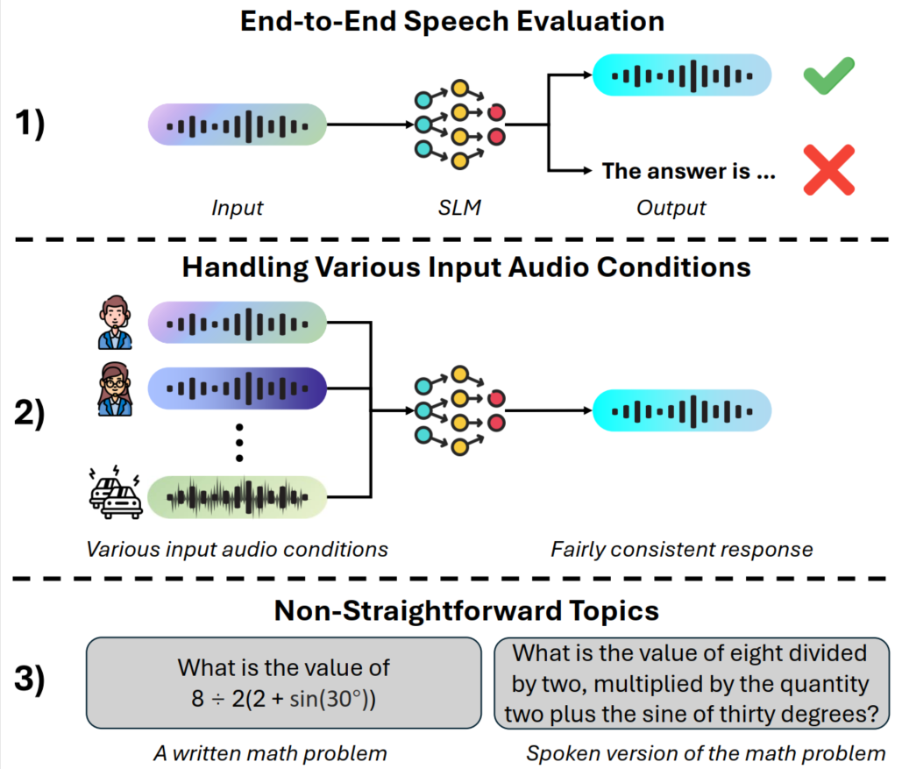

# VoxEval
[](https://huggingface.co/datasets/qqjz/VoxEval)
[](https://arxiv.org/abs/2501.04962)

Github repository for paper: [*VoxEval: Benchmarking the Knowledge Understanding Capabilities of End-to-End Spoken Language Models*](https://arxiv.org/abs/2501.04962)

VoxEval is a novel speech question-answering benchmark specifically designed to assess SLMs' knowledge understanding through purely speech-based interactions.

Below are the three highlights of our VoxEval benchmark:
- End-to-end speech-based evaluation: Both input and output are audio-based.
- Diverse audio conditions: VoxEval includes audio files featuring a variety of speakers, speaking styles, and audio qualities.
- Complex spoken evaluations: It supports advanced spoken assessments, including spoken math tasks.


<!--  -->

## Download Data
You can access our **[VoxEval Dataset Repository](https://huggingface.co/datasets/qqjz/VoxEval)** on 🤗 Hugging Face to directly download the dataset.

Below is the layout of the dataset folder. `all_fewshot_examples` folder contains the few shot examples for the evaluation. `math_CoT_fewshot` folder contains the few shot examples for evaluating the math subjects via Chain-of-Thought prompting.
`test` folder contains the actual test data in VoxEval.
```
  # ├── Root Folder
  # │   ├── all_fewshot_examples
  # │       ├── alloy (different speaker voice)
  # │           ├── abstract_algebra_4o (different subjects)
  # │               ├── XXX.mp3
  # │               ├── ...
  # │           ├── ...
  # │       ├── echo
  # │       ├── ...
  # │   ├── math_CoT_fewshot
  # │       ├── alloy
  # │           ├── college_mathematics_dev_4o
  # │               ├── XXX.mp3
  # │               ├── ...
  # │           ├── elementary_mathematics_dev_4o
  # │           ├── high_school_mathematics_dev_4o
  # │   ├── test
  # │       ├── alloy (different settings)
  # │           ├── abstract_algebra_4o (different subjects)
  # │               ├── XXX.mp3
  # │               ├── ...
  # │           ├── ...
  # │       ├── echo
  # │       ├── ...
```

## Evaluation results of existing end-to-end Spoken Language Models
| **SLMs**            | **SpeechGPT** | **TWIST** | **SPIRIT-LM** | **Moshi** | **GLM-4-Voice** |
|----------------------|---------------|-----------|---------------|-----------|-----------------|
| **Speakers**         |               |           |               |           |                 |
| Alloy                | 0.0001        | 0.0480    | 0.2084        | 0.1216    | 0.3763          |
| Echo                 | 0.0001        | 0.0558    | 0.2096        | 0.1221    | 0.3764          |
| Fable                | 0.0000        | 0.0116    | 0.2084        | 0.1153    | 0.3642          |
| Nova                 | 0.0001        | 0.0332    | 0.2070        | 0.1298    | 0.3677          |
| Onyx                 | 0.0002        | 0.0275    | 0.1966        | 0.1192    | 0.3764          |
| Shimmer              | 0.0000        | 0.0516    | 0.2076        | 0.1205    | 0.3815          |
| **Speaking Styles**  |               |           |               |           |                 |
| Linguistic           | 0.0001        | 0.0488    | 0.2044        | 0.1187    | 0.3643          |
| Speed                | 0.0001        | 0.0503    | 0.1911        | 0.1013    | 0.3469          |
| Pitch                | 0.0000        | 0.0544    | 0.1788        | 0.0609    | 0.3345          |
| **Audio Qualities**  |               |           |               |           |                 |
| Noise                | 0.0000        | 0.0368    | 0.1950        | 0.1018    | 0.3695          |
| Other Env Acoustics  | 0.0001        | 0.0434    | 0.2019        | 0.1051    | 0.3728          |
| **Underlying Text LMs** | **Llama-7B** | **Llama-7B** | **Llama-2-7B** | **Helium-7B** | **GLM-4-9B** |
| Text MMLU            | 0.3510        | 0.3510    | 0.4530        | 0.5430    | 0.7470          |

## What's Next
- The VoxEval evaluation code will be released soon.

## License
The dataset is licensed under the Creative Commons Attribution 4.0.

## Citation
```
@article{cui2025voxeval,
  title={VoxEval: Benchmarking the Knowledge Understanding Capabilities of End-to-End Spoken Language Models},
  author={Cui, Wenqian and Jiao, Xiaoqi and Meng, Ziqiao and King, Irwin},
  journal={arXiv preprint arXiv:2501.04962},
  year={2025}
}
```
